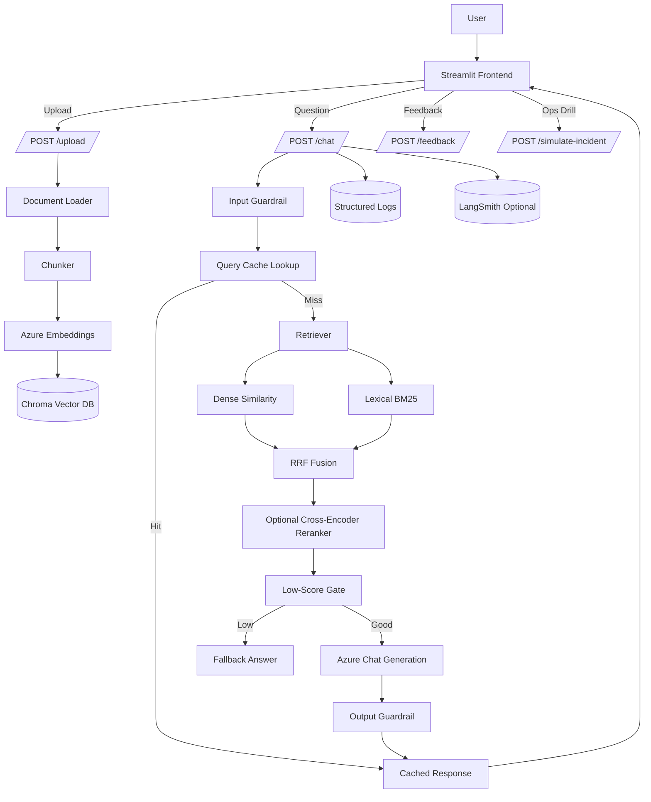

# local-llmops-rag-assistant

Production-style local RAG assistant with:

- FastAPI backend for ingestion, retrieval, generation, feedback, and incident simulation.
- Streamlit frontend for document upload and chat.
- Azure OpenAI for embeddings and grounded answer generation.
- Chroma local vector store (with in-memory fallback if Chroma is unavailable).
- Hybrid retrieval (dense + lexical BM25) with optional reranking.
- Guardrails, structured logging, LangSmith tracing integration, and RAGAS evaluation.

This README documents the project end to end, including architecture, dependency choices, setup, API contracts, configuration, operations, and troubleshooting.

## 1) End-to-End Architecture



## 2) Core Features

- Multi-format ingestion: PDF, TXT, and Markdown.
- Recursive chunking with overlap to preserve continuity.
- Dense retrieval over vector embeddings.
- Hybrid retrieval using dense + lexical BM25 with reciprocal-rank fusion.
- Optional reranking with BGE reranker model.
- Low-score fallback gate to avoid unsupported hallucinated answers.
- Input and output guardrails.
- Query-level cache for repeated/similar questions (TTL + max entries + similarity threshold).
- Structured observability logs for latency, retrieval scores, token usage, and errors.
- Optional LangSmith traces.
- RAGAS quality evaluation script.

## 3) Project Structure

- backend/app
    - API entrypoint and service wiring.
    - RAG pipeline modules: load, chunk, embed, retrieve, rerank, generate.
    - Guardrails and incident simulation.
    - Observability and structured logs.
- frontend/streamlit_app.py
    - Upload and chat UI.
    - Feedback controls.
    - Incident simulation trigger.
- evaluation
    - RAGAS evaluation script.
    - Evaluation dataset and results JSON.
- data/uploads
    - Uploaded files persisted locally.
- vector_db
    - Chroma persistence directory.
- logs
    - JSON logs for diagnostics and metrics.
- docs
    - Architecture and incident runbook notes.

## 4) Frameworks and Libraries (Detailed)

### Application Frameworks

| Library / Framework | Where Used | Why It Is Used |
|---|---|---|
| FastAPI | backend API server | High-performance typed REST API, request/response validation, clean endpoint development. |
| Uvicorn | backend runtime | ASGI server for running FastAPI in local/prod-style mode. |
| Streamlit | frontend UI | Fast local UI for upload/chat workflows and operational controls. |

### LLM and Retrieval Stack

| Library / Framework | Where Used | Why It Is Used |
|---|---|---|
| openai | backend/app/rag/embeddings.py, backend/app/rag/generator.py | Azure OpenAI-compatible SDK for embeddings and chat completions. |
| chromadb | backend/app/rag/vector_store.py | Local vector database for chunk storage and nearest-neighbor retrieval. |
| pypdf | backend/app/rag/document_loader.py | Reliable text extraction from PDFs page by page. |
| rank-bm25 | backend/app/rag/vector_store.py | Lexical retrieval branch for hybrid search. |
| sentence-transformers | backend/app/rag/reranker.py | Optional cross-encoder reranker to improve top-k ordering quality. |

### Config, Validation, and HTTP

| Library / Framework | Where Used | Why It Is Used |
|---|---|---|
| pydantic | schemas and settings fields | Strong typed validation for API models and config fields. |
| pydantic-settings | backend/app/config.py | Environment-driven settings model and alias mapping from .env. |
| python-dotenv | evaluation/ragas_eval.py | Loads .env for evaluation scripts and local runs. |
| python-multipart | upload endpoint | Supports multipart file uploads in FastAPI. |
| httpx | frontend/streamlit_app.py | HTTP client for frontend-to-backend API calls. |

### Observability and Evaluation

| Library / Framework | Where Used | Why It Is Used |
|---|---|---|
| langsmith | tracing integration | Optional request traces and span-level visibility for debugging/analysis. |
| ragas | evaluation/ragas_eval.py | Standard RAG quality metrics: faithfulness, relevancy, precision, recall. |
| datasets | evaluation/ragas_eval.py | Dataset wrapper for evaluation inputs. |
| langchain-openai (via environment) | evaluation/ragas_eval.py | Azure Chat and Embedding clients used by RAGAS evaluator. |

### Testing

| Library / Framework | Where Used | Why It Is Used |
|---|---|---|
| pytest | backend/tests | Unit and API behavior validation. |
| pytest-mock | backend/tests | Convenient mocking of components in tests. |

## 5) Runtime Behavior (Important)

### Chroma and Fallback Behavior

- If Chroma is unavailable (common in some Windows + Python 3.12 setups), the app falls back to in-memory vector storage.
- In-memory index is reset on backend restart.
- To reduce this impact, startup bootstrapping reindexes files from data/uploads automatically.

### Query Cache Behavior

- Cache checks happen before retrieval/generation.
- Exact and similar question matches are supported.
- Similarity uses Jaccard token overlap with configurable threshold.
- Cache clears automatically after new uploads so stale answers are not served.

## 6) API Endpoints

### GET /health

- Purpose: readiness check.
- Response fields: status, vector_store_ready, openai_configured.

### POST /upload

- Purpose: ingest document and index chunks.
- Accepted types: pdf, txt, md.
- Flow: store file -> load -> chunk -> embed -> upsert to vector store.

### POST /chat

- Purpose: grounded Q&A.
- Flow:
    - input guardrail
    - query cache lookup
    - retrieve (dense / hybrid / rerank)
    - low-score gate fallback if retrieval confidence is low
    - generation
    - output guardrail
    - response + citations + latency + trace metadata

### POST /feedback

- Purpose: collect thumbs_up or thumbs_down linked to question/answer/trace.

### POST /simulate-incident

- Purpose: trigger incident simulation for drills.
- Supported incident types:
    - openai_timeout
    - vector_db_failure
    - low_retrieval_score
    - prompt_injection
    - high_token_usage

## 7) Configuration Reference (.env)

### Azure OpenAI

- AZURE_OPENAI_API_KEY
- AZURE_OPENAI_ENDPOINT
- AZURE_OPENAI_API_VERSION
- AZURE_OPENAI_CHAT_DEPLOYMENT
- AZURE_OPENAI_EMBEDDING_DEPLOYMENT
- AZURE_OPENAI_EMBEDDING_API_VERSION
- AZURE_OPENAI_EMBEDDING_API_KEY
- AZURE_OPENAI_EMBEDDING_ENDPOINT

### Tracing

- LANGSMITH_TRACING
- LANGSMITH_API_KEY
- LANGSMITH_PROJECT

### App Runtime

- BACKEND_HOST
- BACKEND_PORT
- BACKEND_BASE_URL
- STREAMLIT_PORT

### Storage Paths

- CHROMA_PERSIST_DIRECTORY
- CHROMA_COLLECTION_NAME
- UPLOADS_DIRECTORY
- LOG_FILE_PATH

### Retrieval Controls

- TOP_K
- ENABLE_HYBRID_RETRIEVAL
- HYBRID_DENSE_WEIGHT
- HYBRID_LEXICAL_WEIGHT
- HYBRID_RRF_K
- ENABLE_RERANKER
- RERANKER_MODEL
- RERANKER_CANDIDATE_K
- LOW_RETRIEVAL_SCORE_THRESHOLD
- MAX_CONTEXT_CHARS
- REQUEST_TIMEOUT_SECONDS

### Query Cache Controls

- ENABLE_QUERY_CACHE
- QUERY_CACHE_TTL_SECONDS
- QUERY_CACHE_MAX_ENTRIES
- QUERY_CACHE_SIMILARITY_THRESHOLD

## 8) Local Setup (Windows)

1. Create virtual environment.

```powershell
python -m venv .venv
.\.venv\Scripts\Activate.ps1
```

2. Install dependencies.

```powershell
pip install -r requirements.txt
```

3. Create and edit .env.

```powershell
copy .env.example .env
```

4. Start backend.

```powershell
python -m uvicorn backend.app.main:app --host 127.0.0.1 --port 8000 --reload
```

5. Start frontend in another terminal.

```powershell
python -m streamlit run frontend/streamlit_app.py --server.port 8501
```

6. Open frontend.

- http://127.0.0.1:8501

## 9) Quality and Evaluation

Run RAGAS:

```powershell
python evaluation/ragas_eval.py
```

Output file:

- evaluation/ragas_results.json

Important evaluation note:

- The current evaluation script reads evaluation/eval_dataset.json directly.
- If answer/context fields in that dataset are static, RAGAS may not reflect live backend changes.
- For true end-to-end quality tracking, generate eval records from live /chat responses before scoring.

## 10) Tests

Run backend tests:

```powershell
pytest backend/tests -q
```

## 11) Operational Observability

The app logs structured events for:

- latency_recorded
- retrieval_scores_recorded
- token_usage_recorded
- guardrail_event
- upload/chat errors

With tracing enabled, responses include trace_id and trace_url for request drill-down.

## 12) Security and Guardrails

Input guardrail:

- Blocks common prompt injection phrases (for example: ignore previous instructions).

Output guardrail:

- Blocks secret-like patterns.
- Checks grounding overlap with retrieved context.
- Requires citations when context was used.

## 13) Known Limitations

- Chroma may fail to install on some Windows Python 3.12 environments without build tools.
- LangSmith may fail behind strict SSL/corporate cert environments unless cert chain is configured.
- Current default cache is in-memory and resets on backend restart.
- RAGAS script currently evaluates dataset-driven records, not always live generated responses.

## 14) Troubleshooting Guide

### Backend returns fallback for every question

- Check that documents are uploaded and indexed.
- Check retrieval scores in logs.
- Confirm LOW_RETRIEVAL_SCORE_THRESHOLD is not too high.

### Retrieval count is zero after restart

- You may be running in in-memory fallback mode.
- Ensure uploads exist and startup reindexing ran.
- Prefer a working Chroma setup for persistent local vectors.

### Streamlit cannot reach backend

- Verify BACKEND_BASE_URL and backend host/port.
- Verify backend health at /health.

### Slow first response, fast repeated response

- Expected: first request includes retrieval + LLM generation.
- Repeated/similar requests are served via query cache when enabled.

## 15) Suggested Next Improvements

- Build live-eval dataset generation from backend /chat calls.
- Add persistent disk cache or Redis for cross-restart cache retention.
- Add per-component timing spans for embed/retrieve/generate breakdown in logs.
- Expand evaluation dataset beyond a few examples for more stable quality signals.

## 16) Local-to-Production Mapping

- Chroma local vector DB -> Azure AI Search vector index.
- Local structured logs -> Azure Monitor / Log Analytics / App Insights.
- Local process model -> Azure App Service / Container Apps / AKS.
- .env secrets -> Key Vault + managed identity.

---

This repository is intentionally local-first so you can iterate quickly on RAG quality, latency, and reliability before moving to managed cloud infrastructure.
