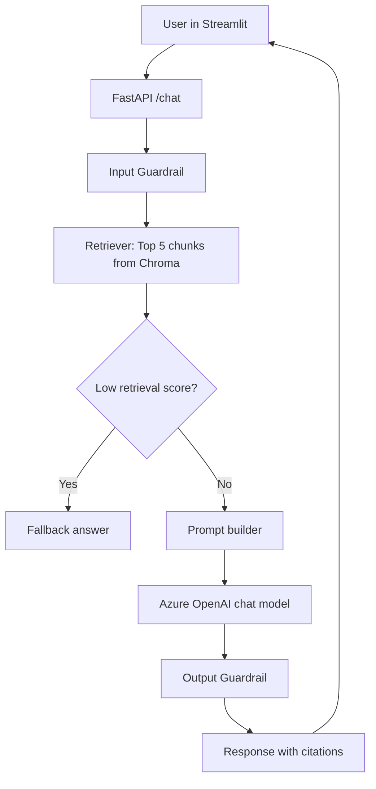
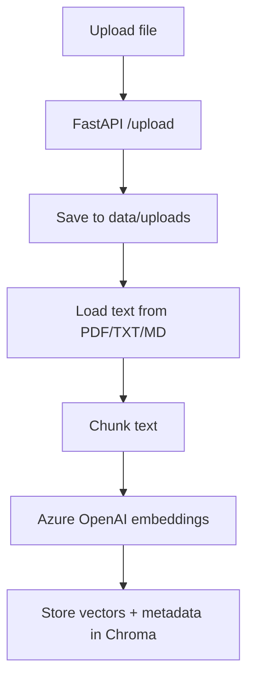

# Architecture

This project is a local production-style LLMOps RAG assistant using Python 3.11.

## Components

- Streamlit frontend for upload and chat UX.
- FastAPI backend for ingestion, retrieval, generation, feedback, and incident simulation APIs.
- Azure OpenAI for embeddings and chat completions.
- Chroma local persistent vector store in `vector_db`.
- Local JSON logs written to `logs/app.log`.
- Optional LangSmith tracing for request workflow visibility.
- RAGAS evaluation for quality metrics.

## Request Flow

## Upload Flow

## Local to Azure Production Mapping

- Local Chroma vector DB -> Azure AI Search vector index.
- Local file uploads -> Azure Blob Storage + ingestion jobs.
- Local logs file -> Azure Application Insights / Log Analytics.
- Local process manager -> Azure App Service or AKS.
- Local .env secrets -> Azure Key Vault + managed identity (when RBAC is available).
